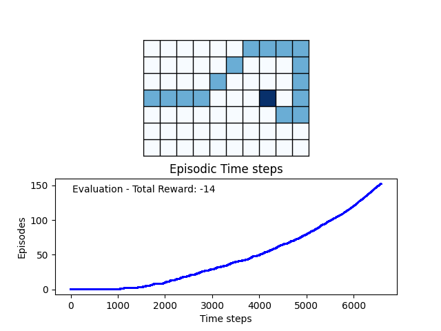

# Q-learning simulation
A simple Python simulation for a Q-learning algorithm, in a Windy Grid World game.

# Game description
The game is very simple, where there is an agent on a grid and its goal is to reach a point on that grid.

There is a crosswind running upward through the middle of the grid.

We introduce a 3 type of actions the agent can take:

- four-actions set (up, down, left, right)

- eight-actions set (includes the diagonal movements)

- nine-actions set (includes the no-movement action)

The agent gets 0 reward when reaching the goal and -1 otherwise

I also introduced a traps with -5 penalty

# Demo

`py .\main.py`

### Args

- -a | --actions  | Number of actions that agent can take (4, 8, 9)
- -v | --verbose  | Verbose
- -e | --episodes | Number of training episodes
- -t | --traps    | Number of traps (0,1,2,3,4)

# Algorithm description
In progress...

# References
- Sutton, R. S., & Barto, A. G. (2018). Introduction to Reinforcement Learning (2nd ed.). MIT Press.
